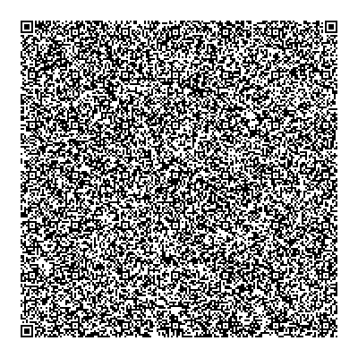

# UZ1

*By [Jace Voracek](http://www.uz1.org/)*

## Usage

**Requirements**:
Python 3 or above. No external libraries needed.

**To compress**:
```
python3 uz1.py compress fileNameWithExtensionHere
```

**To decompress**:
```
python3 uz1.py decompress fileNameWithExtensionHere.uz1
```

## About

UZ1 is a lossless compression algorithm designed to compress files that generally can't be compressed further using conventional means. This makes UZ1 an "Unconventional ZIP".

**Does it succeed?**

Usually. Guaranteeing file compression is impossible since doing so violates the pigeonhole principle. UZ1 can often squeeze a few extra bytes from files that lack patterned data structures or are considered "highly compressed". If the file won't shrink, the UZ1 file size is usually the exact same as the source file or only a byte or two larger. This is a distinguishing feature of UZ1 since other compression algorithms often increase the file size by many kilobytes (partly due to archiving metadata) if a file cannot be compressed further.

**Who is this for?**

Compression enthusiasts. Use cases where saving every byte matters. The amount of bytes saved when processing most files is often nominal compared to other compression algorithms, so it's not too practical as a daily driver for personal or commercial use.

## Known Issues

* Windows OS specific: The script often comes to a near grinding halt when processing the last portion of large >1GB files. Has not been encountered in Ubuntu 20.04 or Mac OS Big Sur (M1).
* The v0.1 Python implementation of UZ1 is unpolished and has slow performance.
* The UZ1 specification isn't finalized and there may be lingering issues. Please verify checksum hashes of decompressed files with the originals.

## Upcoming Features

* Improved compression ratio using key sizes other than eight bits. This also will be achieved by removing the 16-bit limitation for the max amount of bits that are compressed per segment (currently using for testing).

## How does UZ1 work?

UZ1 operates by having dynamically-sized pieces of the source file split into "segments". Each segment consists of a nearly-full permutation of each sequence of n bits (currently 8 in the v0.1 Python implementation). The one n-bit sequence that is not in the permutation will be written as the "key" if there is a high frequency of a n bit sequence detected in the segment. Using this key allows UZ1 to represent the next few bits after the segment (decreasing the file size) while preserving the integrity of the original n bit sequence. For segments where the number of each sequence in the permutation is evenly distributed, this segment generally cannot be compressed so a "fake key" is written instead. The logic with the fake key usually does not increase the size of the output. The fake key is beneficial to ensure that written segment in the compressed file usually remains the same size as the source if a segment cannot compress. Further details and examples when the UZ1 specification is published.

**Any examples of files that don't work well with UZ1?**

Oddly enough plaintext files don't work well. UZ1 depends on permutations of bit sequences, which makes UZ1 the only compression algorithm in the world that can't compress standalone plaintext very well if at all. (LOL). To compress a plaintext file with UZ1, compress it with something else first before attempting to use UZ1. This sometimes applies to other pattern-structured files as well.

**Are there other "cons"?**

No archiving support (only can compress one file). Also no checksum support. Be sure to validate the hashes of decompressed files with the source files to ensure they're the same since v.01 is not a clean implementation. Additionally some aspects in v0.1 are nerfed for convenience to work with and test. Once the UZ1 specification is published there might be a better compression ratio, though files compressed with previous versions such as v0.1 most likely will not be supported.

**Can the Python implementation fit inside a QR code?**

A very important question. Yes it can! When "minified" and compressed, v0.1 becomes 2,898 bytes which barely fits within the max 2,953 byte quota. Encoded using File2QR on Android.



**Let's see some benchmarks:**

Coming soon. Will be published on [uz1.org](http://www.uz1.org/) once the homepage is built.

## License:

Licensed with a permissive MIT license. Feel free to directly use or create derivatives from UZ1 in any non-commercial or commercial project. Porting the current Python implementation to different languages or creating custom fixes is also welcome. Citing uz1.org would be appreciated.

## Support:

UZ1 is a personal hobby project that is gradually completed during my free time and will be lightly-maintained. If you think this is cool, feel free to donate! I completed my undergrad at Brigham Young University - Idaho about two years ago and am anticipating on beginning a graduate program next year, so funds will be set aside for education. If UZ1 is used in work by you or your team, I'd love to hear about it!

PayPal: [Donate](https://www.paypal.com/donate?hosted_button_id=66X3KKMLU75WE)
BTC: 3JoT7fXsNQi8Gub1wWdyos38M5R1q4prKG
ETH: 0x04C3Fc256CD4A2c22697C2152EAb277AeF1bBce4

Thanks for trying out UZ1!
